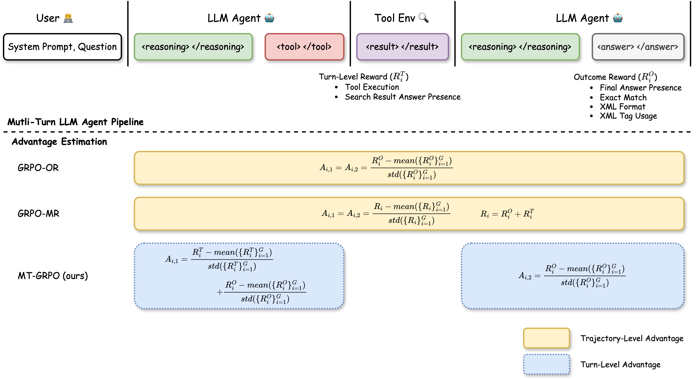

# Reinforcing Multi-Turn Reasoning in LLM Agents via Turn-Level Credit Assignment

<a href="https://arxiv.org/abs/2505.11821">
  
</a>

This repository contains the code in our work: ["Reinforcing Multi-Turn Reasoning in LLM Agents via Turn-Level Credit Assignment"](https://arxiv.org/abs/2505.11821)



## Installation

Install Python environment
```bash
conda create -n verifier_env python=3.11 -y
source activate verifier_env

pip install -e .
pip install flash-attn --no-build-isolation
```

Install Java environment (if needed)
```bash
apt-get remove --purge openjdk* -y

apt-get update
apt-get install -y openjdk-21-jdk

java -version
```

You can run `bash quick_start_install.sh` for a quick start installation.

Download Wiki search index 
```bash
python verifiers/tools/local_wiki_search.py
```

## Multi-Turn Agent Overview

Tool Env: `verifiers/envs/tool_env.py`

Search Tool: `verifiers/tools/local_wiki_search.py`

System Prompt: `verifiers/prompts/system_prompts.py`

Reward Functions: `verifiers/rubric/triviaqa_rubric.py`
- Turn-Level Rewards:
    - tool execution: `tool_execution_reward_func`
    - search result answer presence: `exist_answer_in_search_results`
- Outcome Rewards:
    - final anwer presence: `exist_answer_reward_func`
    - exact match: `exact_match_reward_func`
    - xml format: `parser.get_format_reward_func`
    - xml tage usage: `parser.get_xml_reward_func`

Trainers:
- GRPO: original GRPO with trajectory-level advantage estimation 
    - **GRPO-OR**: GRPO using only outcome rewards
    - **GRPO-MR**: GRPO using merged outcome and turn-level rewards 
- **MT-GRPO**: GPRO variant with turn-level advantage estimation using both outcome and
turn-level rewards


## Usage

Run MT-GRPO
```bash
# bash scripts/run_mt_grpo.sh
accelerate launch --config-file configs/zero3.yaml --num-processes 7 \
    verifiers/examples/triviaqa_search.py \
    --model_name "Qwen/Qwen2.5-7B" \
    --num_gpus 8 \
    --learning_rate 1e-6 \
    --num_generations 21 \
    --per_device_train_batch_size 12 \
    --grad_accum_steps 4 \
    --num_iterations 2 \
    --max_steps 300 \
    --beta 0 \
    --trainer "mt_grpo" \
    --turn_advantage_coef 1 \
```

Run GRPO-OR
```bash
# bash scripts/run_grpo_or.sh
accelerate launch --config-file configs/zero3.yaml --num-processes 7 \
    verifiers/examples/triviaqa_search.py \
    --model_name "Qwen/Qwen2.5-7B" \
    --num_gpus 8 \
    --learning_rate 1e-6 \
    --num_generations 21 \
    --per_device_train_batch_size 12 \
    --grad_accum_steps 4 \
    --num_iterations 2 \
    --max_steps 300 \
    --beta 0 \
    --trainer "grpo" \
    --no_turn_reward \
```

Run GRPO-MR
```bash
# bash scripts/run_grpo_mr.sh
accelerate launch --config-file configs/zero3.yaml --num-processes 7 \
    verifiers/examples/triviaqa_search.py \
    --model_name "Qwen/Qwen2.5-7B" \
    --num_gpus 8 \
    --learning_rate 1e-6 \
    --num_generations 21 \
    --per_device_train_batch_size 12 \
    --grad_accum_steps 4 \
    --num_iterations 2 \
    --max_steps 300 \
    --beta 0 \
    --trainer "grpo" \
```

## Acknowledgement

Our code implementation is built upon the open-source project [verifiers](https://github.com/willccbb/verifiers).

## Citation

If you find our work useful in your research please consider citing our paper:
```
@article{zeng2025reinforcing,
  title={Reinforcing Multi-Turn Reasoning in LLM Agents via Turn-Level Credit Assignment},
  author={Zeng, Siliang and Wei, Quan and Brown, William and Frunza, Oana and Nevmyvaka, Yuriy and Hong, Mingyi},
  journal={arXiv preprint arXiv:2505.11821},
  year={2025}
}
```
